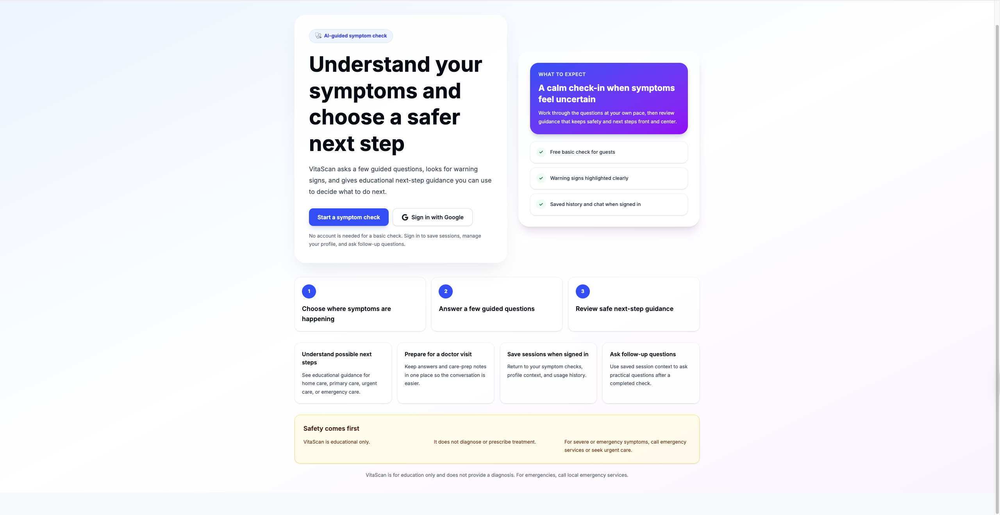
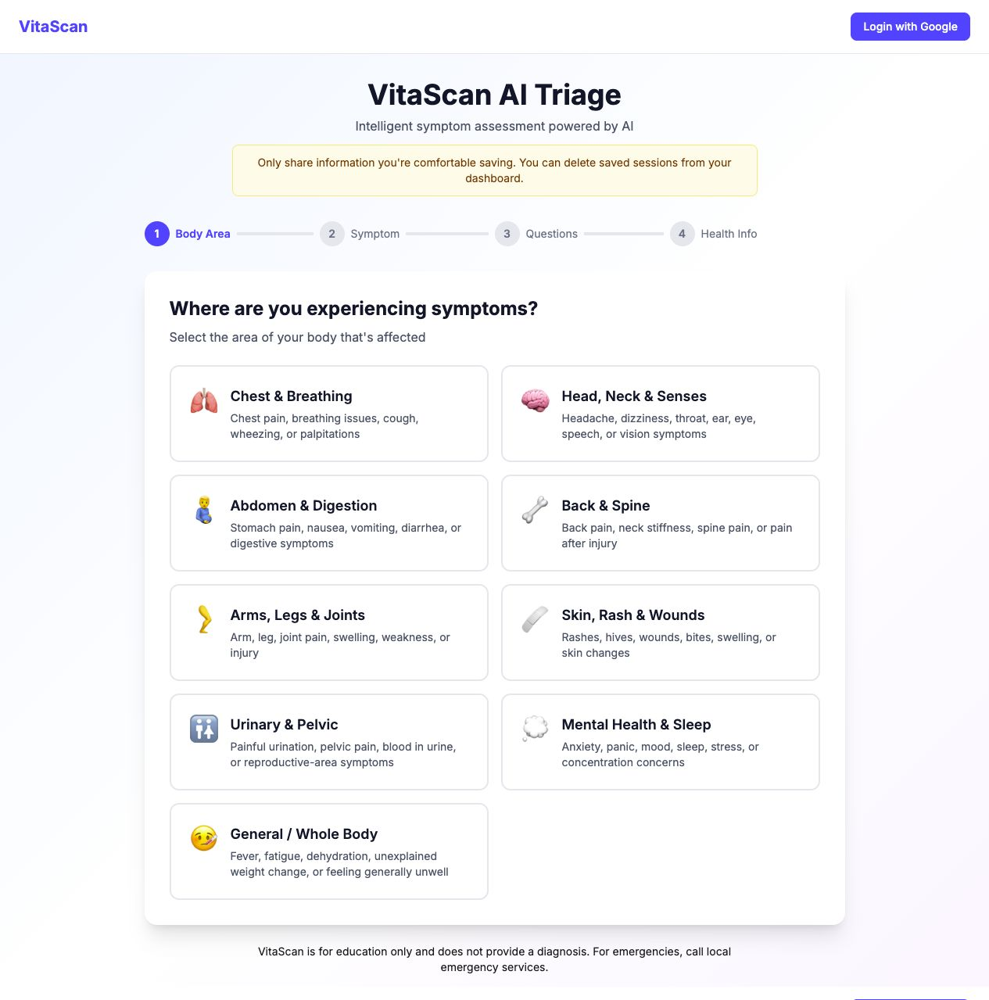
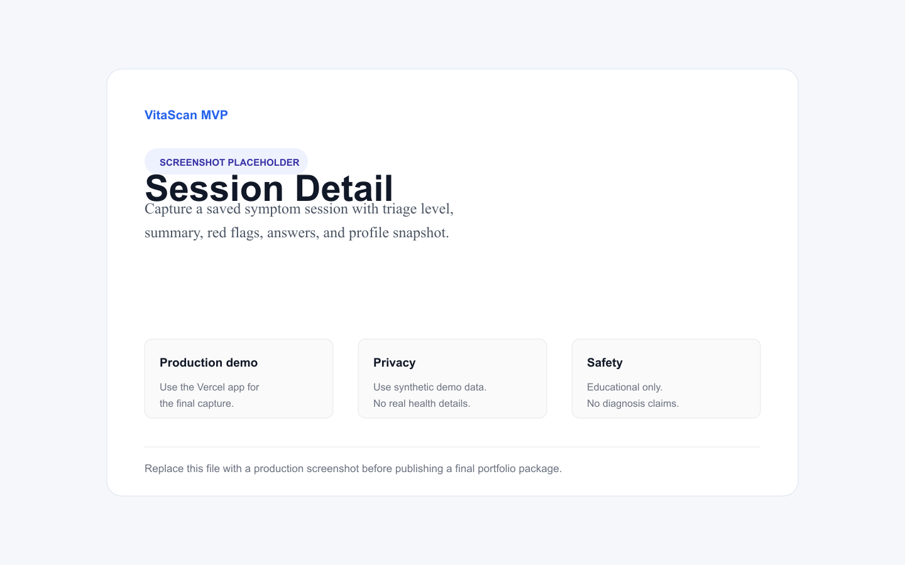
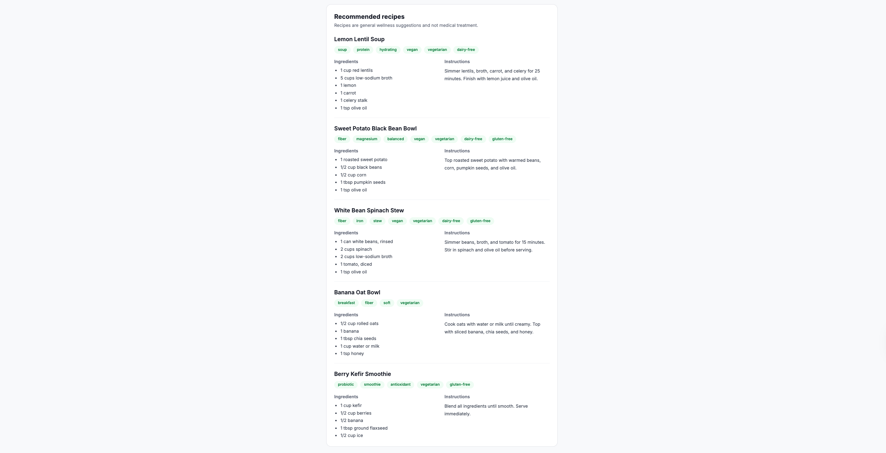
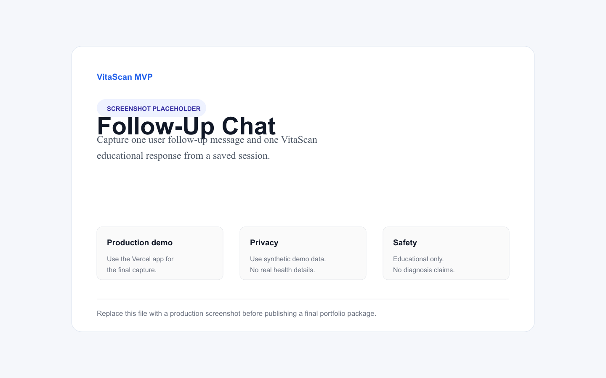

# VitaScan

[](https://github.com/AmiRaGaL/vitascan/actions/workflows/ci.yml)

VitaScan is an AI-powered symptom triage and health guidance MVP. It helps users organize symptoms, see educational next-step guidance, save sessions, and ask follow-up questions. VitaScan is not a medical device and does not provide a diagnosis.

## Demo

- Live demo: [https://vitascan-web-rho.vercel.app/](https://vitascan-web-rho.vercel.app/)
- Demo video: _In Progress._











### What This Demonstrates Technically

- Full-stack TypeScript monorepo with Next.js App Router, NestJS, and pnpm workspaces.
- Supabase Auth, Postgres persistence, row-level security, saved sessions, profiles, usage counters, recipes, and chat.
- AI-assisted symptom guidance with rule-based red-flag overrides and conservative safety positioning.
- Lightweight RAG grounding with `pgvector`, knowledge-base chunks, saved reference summaries, and fallback behavior.
- Production-minded API guardrails: CORS, security headers, structured logging, rate limiting, health checks, Swagger docs, CI, and focused tests.

## Project Overview

The MVP demonstrates a full web/API health guidance flow:

1. Continue as a guest or log in with Google.
2. Create or update a basic health profile.
3. Complete a guided symptom check.
4. Review a saved session with triage guidance and red flags.
5. Use recipes and follow-up chat where enabled.

Safety positioning is intentionally conservative: educational only, no diagnosis, no prescriptions, and emergency guidance for severe or red-flag symptoms.

## Current MVP Status

Implemented:

- Guest symptom checks with basic daily limit behavior.
- Supabase Google login.
- Health profile create/update.
- Logged-in symptom checks saved to session history.
- Dashboard usage counts, profile prompt, search/filter/sort, pagination, print route, and session deletion.
- Saved session detail pages with emergency guidance, copy summary, print summary, recipes, chat entry, and delete.
- Post-triage chat for logged-in users with daily chat limits.
- Basic RAG grounding with `pgvector` knowledge-base chunks.
- Supabase-backed RLS policies for user-owned data.
- Production guardrails: CORS, security headers, safe structured logging, rate limiting, and friendly error states.
- API `/health` and `/health/deep` endpoints for deployment diagnostics.

Intentionally not included:

- Mobile app production flow.
- Payments or subscription billing.
- HIPAA or regulated medical-device claims.
- Clinical validation.
- PDF generation or email sharing.

## Tech Stack

- Web: Next.js App Router, React, Tailwind CSS
- API: NestJS, TypeScript
- Database/Auth: Supabase Postgres and Supabase Auth
- AI: Groq API
- RAG: Supabase Postgres with `pgvector`
- Monorepo: pnpm workspaces

## Local Setup

Install dependencies:

```bash
pnpm install
```

Copy env templates and fill in local values:

```bash
cp .env.example .env
cp apps/api/.env.example apps/api/.env
cp apps/web/.env.example apps/web/.env.local
```

Run the API:

```bash
pnpm dev:api
```

In non-production environments, interactive API documentation is available at:

```bash
http://localhost:3000/docs
```

Run the web app:

```bash
pnpm dev:web
```

Run both:

```bash
pnpm dev
```

Run focused checks:

```bash
pnpm --filter @vitascan/api build
pnpm --filter @vitascan/api test
pnpm --filter @vitascan/web exec tsc --noEmit
```

## Environment Variables

API:

```bash
SUPABASE_URL=
SUPABASE_SERVICE_ROLE_KEY=
SUPABASE_JWT_SECRET=
GROQ_API_KEY=
EMBEDDING_MODEL=
WEB_ORIGIN=
PORT=
NODE_ENV=
```

Web:

```bash
NEXT_PUBLIC_SUPABASE_URL=
NEXT_PUBLIC_SUPABASE_ANON_KEY=
NEXT_PUBLIC_API_URL=
```

## Docs

- MVP feature checklist: [docs/mvp-feature-checklist.md](docs/mvp-feature-checklist.md)
- Demo script: [docs/demo-script.md](docs/demo-script.md)
- Demo recording checklist: [docs/demo-recording-checklist.md](docs/demo-recording-checklist.md)
- Architecture overview: [docs/architecture.md](docs/architecture.md)
- Deployment guide: [docs/deployment.md](docs/deployment.md)
- Monitoring notes: [docs/monitoring.md](docs/monitoring.md)
- Launch backlog: [docs/launch-backlog.md](docs/launch-backlog.md)
- Manual QA checklist: [docs/qa-checklist.md](docs/qa-checklist.md)
- Screenshot guide: [docs/screenshots/README.md](docs/screenshots/README.md)

## Demo Visuals

Production screenshots for README, portfolio, GitHub, and demo sharing live in [docs/screenshots](docs/screenshots). The current screenshot package includes the landing page, dashboard, profile, guided symptom check, saved session detail, recipes, follow-up chat, and red-flag safety state.

## Roadmap

- Mobile app experience.
- Stronger automated tests and production monitoring.
- Deeper RAG validation, citations UI, and source governance.
- Clinical validation with qualified reviewers.
- Stronger compliance, privacy, audit logging, and security hardening.
- Premium limits or billing if product direction requires it.

## Safety

VitaScan is for education only and does not provide a diagnosis. For emergencies, call local emergency services.
