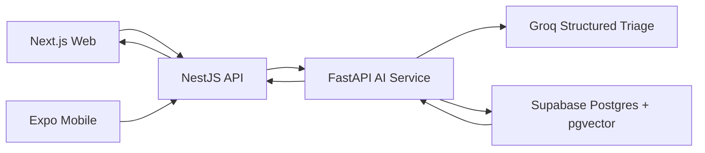

# VitaScan

[](https://github.com/AmiRaGaL/vitascan/actions/workflows/ci.yml)

VitaScan is an AI-powered symptom triage and health guidance MVP. It helps users organize symptoms, see educational next-step guidance, save sessions, and ask follow-up questions. VitaScan is not a medical device and does not provide a diagnosis.

## Overview

VitaScan implements an agentic triage orchestration layer for educational symptom guidance. The product keeps the frontend simple: web and mobile clients talk to the NestJS API, and the API is the only service that calls the FastAPI AI service. The FastAPI service coordinates safety checks, retrieval, structured Groq triage, deterministic response building, trace logging, and offline/live evaluations.

The core design goal is conservative guidance on a free-tier-friendly stack: deterministic red-flag rules run before any LLM call, retrieval and trace logging fail safely, and the app can operate in mock/fallback modes when external AI capacity is unavailable.

## Demo

- Live demo: [https://vitascan-web-rho.vercel.app/](https://vitascan-web-rho.vercel.app/)
- Demo video: _In Progress._


### What This Demonstrates Technically

- Full-stack TypeScript monorepo with Next.js App Router, NestJS, and pnpm workspaces.
- Supabase Auth, Postgres persistence, row-level security, saved sessions, profiles, usage counters, recipes, and chat.
- AI-assisted symptom guidance with rule-based red-flag overrides and conservative safety positioning.
- Agentic FastAPI AI orchestration service with intake normalization, red-flag safety, retrieval, Groq structured triage, deterministic responses, trace logging, evals, and a safety dashboard.
- Lightweight RAG grounding with `pgvector`, knowledge-base chunks, saved reference summaries, and fallback behavior.
- Production-minded API guardrails: CORS, security headers, structured logging, rate limiting, health checks, Swagger docs, CI, and focused tests.

## Project Overview

The MVP demonstrates a full web/API health guidance flow:

1. Continue as a guest or log in with Google.
2. Create or update a basic health profile.
3. Complete a guided symptom check.
4. Review a saved session with triage guidance and red flags.
5. Use recipes and follow-up chat where enabled.

Safety positioning is intentionally conservative: educational only, no diagnosis, no prescriptions, and emergency guidance for severe or red-flag symptoms.

## AI Orchestration Architecture



Client applications do not call FastAPI directly. NestJS owns authentication, user/session ownership checks, usage limits, and app-facing API contracts. FastAPI owns AI orchestration and is protected by an internal `x-service-token` shared with NestJS.

### Agent Workflow

1. **Symptom Intake**: normalizes the incoming user message, preserves raw text internally, and extracts simple duration/severity signals.
2. **Red-Flag Safety**: checks deterministic emergency rules for cardiac symptoms, stroke warnings, and anaphylaxis indicators before any LLM decision.
3. **Medical Retrieval**: retrieves medical chunks from Supabase `pgvector` when embeddings are available; otherwise returns empty citations safely.
4. **Triage Decision**: calls Groq for strict JSON triage on non-overridden cases, validates with Pydantic, retries malformed JSON once, and falls back conservatively.
5. **Response Builder**: uses deterministic templates only, includes citations, and appends the educational safety disclaimer without a second LLM call.
6. **Trace Logger**: stores sanitized pipeline metadata, latency, model/token metadata, validation status, fallback status, and decision metadata in Supabase without logging secrets.

### Free-Tier Design

- No frontend-to-FastAPI calls; a single NestJS boundary keeps token handling and request volume easier to control.
- Red-flag rules short-circuit obvious emergencies without spending LLM tokens.
- Retrieval is optional at runtime until embeddings are available, so triage does not fail when RAG is not ready.
- Groq calls use strict JSON output, low retry counts, 429-aware backoff, and conservative fallback behavior.
- Local-only ingestion can use `sentence-transformers`, but deployed requirements intentionally exclude it.
- Mock evaluation mode runs in CI without Groq calls.

### Evaluation Results

The AI eval suite includes 30 cases:

- 5 `home_care`
- 5 `primary_care`
- 5 `urgent_care`
- 10 emergency red-flag cases
- 5 ambiguous/follow-up-needed cases

Mock eval mode is deterministic and currently reports:

- `triage_accuracy`: 100%
- `red_flag_recall`: 100%
- `json_validity_rate`: 100%
- `fallback_rate`: 0%

Live eval has also been exercised against Groq with strong safety performance:

- `triage_accuracy`: 96.67%
- `red_flag_recall`: 100%
- `json_validity_rate`: 100%
- `fallback_rate`: 0%
- `average_latency_ms`: about 3,590 ms

The live runner supports `--limit`, `--case-id`, and `--delay-seconds` so rate-limited providers can be evaluated incrementally.

## Current MVP Status

Implemented:

- Guest symptom checks with basic daily limit behavior.
- Supabase Google login.
- Health profile create/update.
- Logged-in symptom checks saved to session history.
- Dashboard usage counts, profile prompt, search/filter/sort, pagination, print route, and session deletion.
- Saved session detail pages with emergency guidance, copy summary, print summary, recipes, chat entry, and delete.
- Post-triage chat for logged-in users with daily chat limits.
- Basic RAG grounding with `pgvector` knowledge-base chunks.
- FastAPI AI service with service-token authentication, Groq structured triage, red-flag overrides, trace logs, eval runner, and Render-ready Docker deployment.
- AI safety/evaluation dashboard tab with aggregate trace metrics and latest eval failures.
- Supabase-backed RLS policies for user-owned data.
- Production guardrails: CORS, security headers, safe structured logging, rate limiting, and friendly error states.
- API `/health` and `/health/deep` endpoints for deployment diagnostics.

Intentionally not included:

- Mobile app production flow.
- Payments or subscription billing.
- HIPAA or regulated medical-device claims.
- Clinical validation.
- PDF generation or email sharing.

## Tech Stack

- Web: Next.js App Router, React, Tailwind CSS
- API: NestJS, TypeScript
- AI service: FastAPI, Pydantic, Uvicorn
- Database/Auth: Supabase Postgres and Supabase Auth
- AI: Groq API
- RAG: Supabase Postgres with `pgvector`
- Monorepo: pnpm workspaces

## Local Setup

Install dependencies:

```bash
pnpm install
```

Copy env templates and fill in local values:

```bash
cp .env.example .env
cp apps/api/.env.example apps/api/.env
cp apps/web/.env.example apps/web/.env.local
```

Run the API:

```bash
pnpm dev:api
```

In non-production environments, interactive API documentation is available at:

```bash
http://localhost:3000/docs
```

Run the web app:

```bash
pnpm dev:web
```

Run both:

```bash
pnpm dev
```

Run focused checks:

```bash
pnpm --filter @vitascan/api build
pnpm --filter @vitascan/api test
pnpm --filter @vitascan/web exec tsc --noEmit
```

## Environment Variables

API:

```bash
SUPABASE_URL=
SUPABASE_SERVICE_ROLE_KEY=
SUPABASE_JWT_SECRET=
GROQ_API_KEY=
EMBEDDING_PROVIDER=gemini
GEMINI_API_KEY=
EMBEDDING_MODEL=gemini-embedding-2
EMBEDDING_DIMENSIONS=1536
WEB_ORIGIN=
PORT=
NODE_ENV=
AI_SERVICE_URL=
AI_SERVICE_TOKEN=
```

Embeddings default to Gemini with `gemini-embedding-2` and 1,536 dimensions
for Supabase `vector(1536)`. `GEMINI_API_KEY` is required when
`EMBEDDING_PROVIDER=gemini`. OpenAI embedding keys are only needed if
`EMBEDDING_PROVIDER=openai`.

Web:

```bash
NEXT_PUBLIC_SUPABASE_URL=
NEXT_PUBLIC_SUPABASE_ANON_KEY=
NEXT_PUBLIC_API_URL=
```

AI service:

```bash
AI_SERVICE_TOKEN=
SUPABASE_URL=
SUPABASE_SERVICE_ROLE_KEY=
GROQ_API_KEY=
GROQ_TRIAGE_MODEL=
GROQ_FAST_MODEL=
```

## Docs

- MVP feature checklist: [docs/mvp-feature-checklist.md](docs/mvp-feature-checklist.md)
- Demo script: [docs/demo-script.md](docs/demo-script.md)
- Demo recording checklist: [docs/demo-recording-checklist.md](docs/demo-recording-checklist.md)
- Architecture overview: [docs/architecture.md](docs/architecture.md)
- Deployment guide: [docs/deployment.md](docs/deployment.md)
- Monitoring notes: [docs/monitoring.md](docs/monitoring.md)
- Launch backlog: [docs/launch-backlog.md](docs/launch-backlog.md)
- Manual QA checklist: [docs/qa-checklist.md](docs/qa-checklist.md)
- Screenshot guide: [docs/screenshots/README.md](docs/screenshots/README.md)

## Demo Visuals

Production screenshots for README, portfolio, GitHub, and demo sharing live in [docs/screenshots](docs/screenshots). The current screenshot package includes the landing page, dashboard, profile, guided symptom check, saved session detail, recipes, follow-up chat, and red-flag safety state.

## Roadmap

- Mobile app experience.
- Stronger automated tests and production monitoring.
- Deeper RAG validation, citations UI, and source governance.
- Clinical validation with qualified reviewers.
- Stronger compliance, privacy, audit logging, and security hardening.
- Premium limits or billing if product direction requires it.

## Safety

VitaScan provides educational triage guidance only. It is not a diagnosis, does not prescribe medication, does not provide medication dosing, and does not replace a licensed clinician.

Emergency red flags route to immediate-care recommendations. If symptoms may indicate an emergency, VitaScan advises the user to seek immediate care or call local emergency services.

## Resume Bullets

- Built a full-stack AI triage MVP with Next.js, NestJS, FastAPI, Groq, and Supabase, routing all frontend traffic through a secure API boundary before AI orchestration.
- Designed an agentic triage pipeline with symptom intake normalization, deterministic red-flag safety rules, optional medical retrieval, structured Groq JSON decisions, deterministic response templates, and sanitized trace logging.
- Implemented conservative fallback behavior for malformed LLM output, missing embeddings, retrieval failures, and Groq rate limits without breaking the user-facing triage flow.
- Added Supabase `pgvector` retrieval foundations, AI trace logs, eval run tracking, and a dashboard for aggregate safety/evaluation metrics without exposing raw health text.
- Created a 30-case eval suite with mock/live modes, red-flag recall metrics, citation and fallback tracking, CI execution, and live-run throttling controls for provider rate limits.
- Prepared the FastAPI AI service for Render Docker deployment and documented shared service-token configuration between NestJS and FastAPI.
