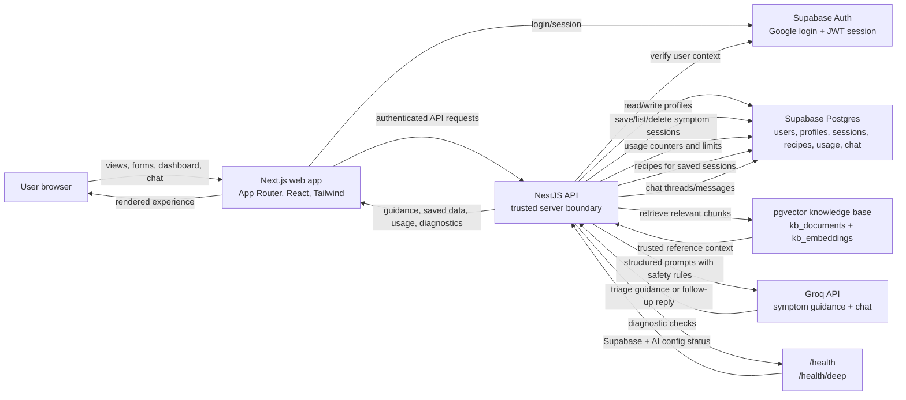

# VitaScan Architecture Overview

VitaScan is an educational health guidance MVP built as a pnpm monorepo.
It pairs a Next.js user experience with a NestJS API, Supabase-backed identity
and data storage, and a Groq-powered guidance layer grounded by a small
`pgvector` knowledge base.

At a recruiter or reviewer level, the important shape is:

- The browser talks only to the Next.js app and API endpoints.
- Supabase Auth owns sign-in and session identity.
- The NestJS API is the trusted coordinator for persistence, usage limits,
  health diagnostics, red-flag overrides, RAG retrieval, and AI calls.
- Supabase Postgres stores application records, while `pgvector` stores
  knowledge-base embeddings used for grounded symptom and chat prompts.

## System Diagram

## Next.js Web

The web app uses Next.js App Router, React, and Tailwind CSS. It owns the user-facing flows:

- Landing page and entry points for guest or logged-in use
- Google login through Supabase Auth
- Dashboard with usage counts and saved sessions
- Health profile create/update
- Symptom check wizard
- Saved session detail with print/copy/delete
- Recipes and post-triage chat for saved sessions
- Friendly error and empty states for demo stability

The web layer keeps the product experience approachable: users can complete a
guest symptom check, sign in, manage a profile, review saved sessions, print or
copy summaries, browse recipe suggestions, and continue with contextual chat.
Sensitive persistence and AI orchestration stay behind the API boundary.

## NestJS API

The API is a NestJS TypeScript service. It coordinates:

- Symptom analysis requests
- Rule-based red-flag overrides
- Saved session creation, listing, detail, and deletion
- Health profile reads/writes
- Usage limit checks
- Recipe recommendations
- Post-triage chat
- Health diagnostics through `/health` and `/health/deep`

The API is the main system boundary. It validates structured symptom payloads,
enforces guest and logged-in usage limits, retrieves reference context, calls
Groq, applies deterministic red-flag overrides, saves completed sessions, and
returns a structured response to the web app. Health endpoints provide fast
deployment checks: `/health` reports basic public readiness, while
`/health/deep` verifies Supabase reachability and AI provider configuration.

## Supabase Auth and Database

Supabase provides Google authentication and Postgres storage.

- Supabase Auth manages user sessions.
- Postgres stores users, health profiles, symptom sessions, usage counters, recipes, chat threads/messages, and knowledge-base documents.
- Row-level security keeps user-owned records scoped to the authenticated user.
- The API uses service-role access for trusted server-side operations.

Core user data flows through Postgres:

- Profiles: created and updated by logged-in users.
- Saved sessions: created after symptom analysis and listed on the dashboard.
- Recipes: queried against saved-session context.
- Chat: stored as threads and messages attached to saved sessions.
- Usage counters: checked before symptom and chat actions.

## AI Provider and RAG

Groq powers structured symptom guidance and follow-up chat. A lightweight RAG layer uses `pgvector`:

1. Educational knowledge-base documents are stored in `kb_documents`.
2. Chunks and embeddings are stored in `kb_embeddings`.
3. The API retrieves relevant chunks before symptom analysis and chat.
4. Retrieved chunks are included as trusted reference context in prompts.

RAG is used for grounding only. The UI does not yet expose citations.
The API still applies rule-based safety overrides after the model response, so
high-risk inputs can force emergency guidance even if the provider returns a
less conservative triage level.

## Saved-Session Flow

1. A user starts as a guest or signs in with Google.
2. A logged-in user can save a health profile.
3. The symptom check sends answers, optional profile context, and auth state to the API.
4. The API checks limits, retrieves KB context, calls the AI provider, applies red-flag overrides, and returns guidance.
5. Logged-in results are saved as symptom sessions.
6. The dashboard loads lightweight session summaries.
7. Detail pages load full saved-session data, recipes, and chat where enabled.

Guest users can receive guidance without creating an account, but saved
sessions, profiles, recipes, and chat are designed around authenticated user
ownership. This gives the demo a simple anonymous path while still showing a
full retained-history product flow.

## Privacy and Security Basics

- Educational-only positioning; no diagnosis or prescription claims.
- Protected API routes for profile, saved sessions, recipes, usage, and chat.
- Supabase RLS for user-owned data.
- CORS restricted by `WEB_ORIGIN` in production.
- Basic rate limiting on sensitive write/action endpoints.
- Structured API logging without request bodies or health details.
- Security headers and public health diagnostics.
